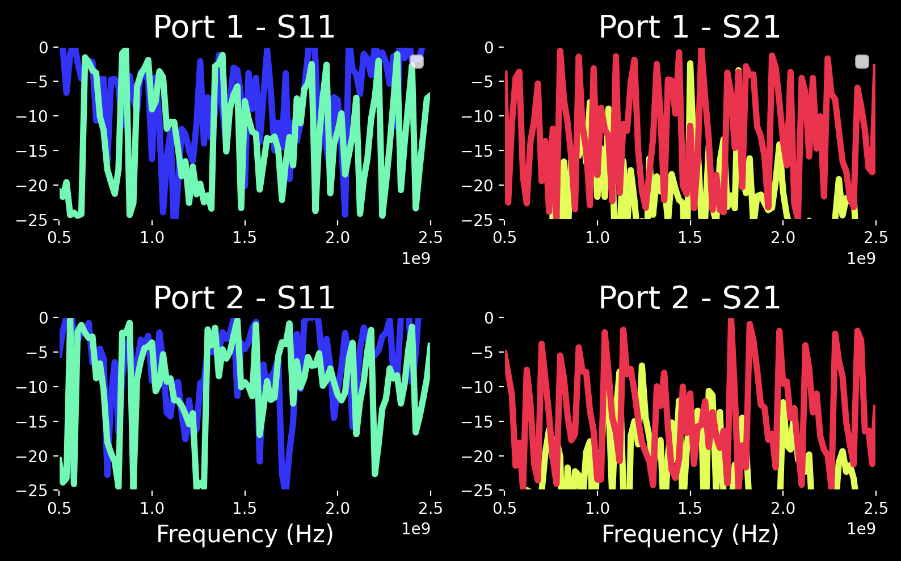
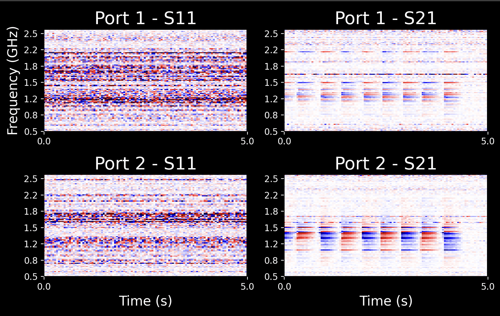
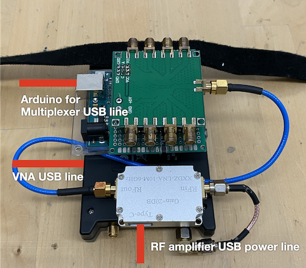
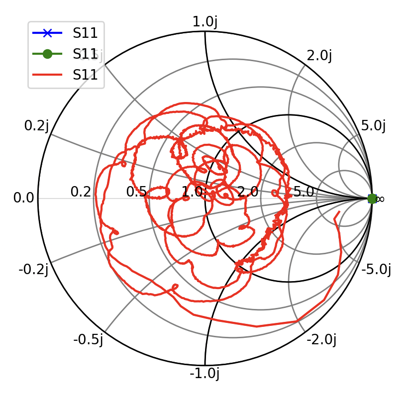
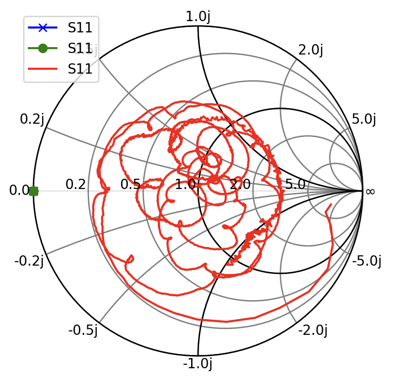
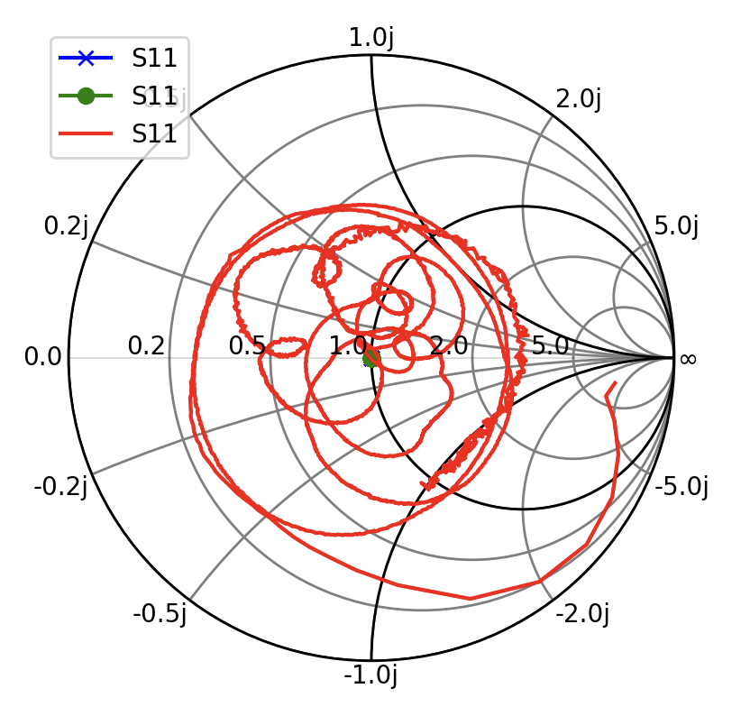
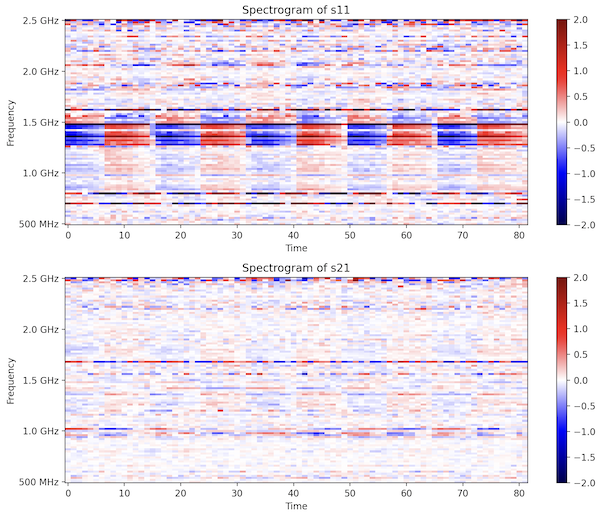

# 1¢ Tag

## General Description of Interface
With this interface, we can read the S-parameters of antenna, time-domain signal changes. You can also calibrate the VNA, save data, and train the classification model.

#### S-Parameter Plot


#### Spectrogram Plot



## Installation
Download the code from [here](./1c-tag-main.zip).
```
python3.10 -m venv venv
source venv/bin/activate
pip install -r requirements.txt
```

## Setup



There three USB cables are connected to your computer, Vector Netowrk Analyzer (VNA), Arduino for multiplexer, and USB power line for amplifier.

Make sure the Arduino serial name is `/dev/cu.usbmodem11401` (on MacOS. Windows may differ to `COM9` or so). If it is different, change the script in the `demo.py`.
```
self.ser_switch = serial.Serial('/dev/cu.usbmodem11401', 9600, timeout=1) # in the setup_rf_switcher function.
```

## Quick Start

To run the demo program, use the following command:
```
python demo.py -S 0.5e9 -E 2.5e9 -N 101 --plot
```

#### Command line Arguments
- `-S`: Start frequency for frequency sweeping.
(Example: 0.5e9 corresponds to 500 MHz.)
- `-E`: End frequency for frequency sweeping.
(Example: 2.5e9 corresponds to 2.5 GHz.)
- `-N`: Number of frequency points to sweep.
(Example: 101 points will be swept.)
Note: This number must be divisible by calibration samples when VNA calibration is enabled (`self.calOn = True`).
- `--plot`: Display the result using matplotlib.
It is recommended to always enable this option for visualization.
- `--smith`: Display Smith Chart.

#### Function Keys
When the visualization is running, you can press several hot keys to trigger functions.
- `p`: Toggling between waterfall spectrogram v.s. S-parameter plot.
- `v`: Rolling window calibration. Basically, only show the differences within time window. Currently, time 1-seconds window is set.
- `j`: Instead of rolling window, using the current signal to reset the visualizer. Basically, the signal are relative change to the time frame at `j` was pressed.
- `o`: Recording data. Press one more time to stop recording.
- `S` (`shift`+`s`): Saving data into folder `data/` with the file name of `data_{number}.npz`. The number is automatically updated. When quit the program, the system also automatically saves the cached data if user did not manually save it.
- `c`: Inferencing classification. It loads `./models/model.pkl` and runs classification. Manually change the labels as desired in the `self.labels = ["Human hand", "None", "Long tag", "Middle tag", "Short tag"]` of `demo.py`
- `q`: Exiting the program.

	*** Minor Keys ↓
- `t`: Time domain frequency visualization. If your data points (`-N`) is 101, it shows 101 lines (which is a lot). I instead use waterfall spectrogram.
- `i`: Convert S-parameter in dB into impedance value. I prefer to see dB values. Use it in special case.


## VNA Calibration

When you change the any cables, amplifier, multiplexer, etc, you must calibrate the VNA device to obtain optimal transmission and reliable impedance measurement. The procedure is like below:

0. Ready for the calibration kit.
There is a small zipper bag with four SMA calibration components. Find these tools.

1. Run calibration program
```
cd utils/
python collect_calib.py
```
2. Collect calibration data.
When you run program, you will see below:
```
Connect open and press ENTER:
```
Then, connect the `open` kit to the **Port 1** after the wires, amplifier, etc. When you press enter, it will take a few seconds to sweep the frequencies and collect data. Subsequently, you will see instructions for `short` and `match`. Connect the corresponding kit for each to the **Port 1**.

Finally, for `thru`, connect the desired wire with female-female SMA connectors throughout **Port 1** to **Port 2**.

Note, when it with multiplexer, you need to do this process repeatedly as many as the channel numbers with each channel acivated. 

3. Confirm calibration result.
The data is saved in `utils/data/`. Below code will show the calibration results.
```
python collect_calib.py
```
Here's example visualization of `litevna+amp+rfswitch-ch1`. (Blue: ground truth, Green: after calibration, Red: before calibration)
| Open       | Short      | Match      | Thru       |
|------------|------------|------------|------------|
|  The green must be at infinite       |  The green must be at zero     |  The green must be at center     | Smith chart for thru is not valid       |
|  The S11 magnitude (blue line) is ideally flat at 0 dB    |  The S11 magnitude (blue line) is ideally flat at 0 dB     |  The S11 magnitude (blue line) is ideally very large minus dB     |  The S21 magnitude (red line) is ideally very large minus dB      |

Over time the hardware may unstable (especially at high frequency), it may not be perfectly calibrated. That's fine. But if calibration result does not significantly match these images, there might be connection issue in the antennas. Check again connections and recalibrate the VNA.

4. Relocate the calibration files as desired.
For example, if the data is with liteVNA, with amplifier, with multiplexer at channel 1 on, you can name the folder name `litevna+amp+rfswitch-ch1`.

5. Apply the calibration data.
In the function `set_calibration` in `demo.py`, you can change the line:
```
name = ["litevna+amp+rfswitch-ch1","litevna+amp+rfswitch-ch2"]
```

The first in the list is for channel 1, the second in the list is for channel 2, etc. Currently as default it is using multiplexer.

## Training & Inferencing

There is a simple training code in `data/train.py`. Train the model by running:
```
python data/train.py
```

Change the number of classes and data path as desired in the script.
```
num_classes = 5
data_path = 'data'
```

Currently it assumes that the file name is formated in `data_{label}.npz` for simplicty (i.e., means the number of files is the same as the number of classes). Change the code as desired.

The trained model is saved at `models/model.pkl`.
If press `c` in the interface of `demo.py`, the program loads the model and shows the classification label.

## Data Collection & Visualization
By pressing `o` in the interface of `demo.py`, the data recording starts. By pressing `S`, the data is saved in the folder `data/`.

The format of data is below:
```
's11': S11 parameters in complex values (impedance). If the data was saved with multiplexer, the odd indices are from channel 1 and the even indices are from channel 2. You may slice it (read_data.py is already slicing it).
's21': S21 parameters in complex values (impedance). If the data was saved with multiplexer, the odd indices are from channel 1 and the even indices are from channel 2. You may slice it (read_data.py is already slicing it).
'ts': time stamp.
'start_freq': start frequency of sweep
'stop_freq': end frequency of sweep
```

To visualize data,
```
python data/read_data.py -filename data/data_1.npz --just
```
The flag `--just` let the same effect as pressing `j` in the demo program. Without this flag, the visualization shows the 1-second rolling window output.

The example file would look like below:

